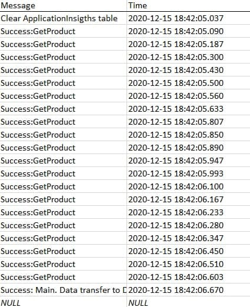

**Лабораторная работа #4. Отчет о проделанной работе**

Моя лаба представляет собой две службы, которые работают одно**moments**но.

1. Служба **FileManager** была разработана в третьей лабы.

2. **DataManager** разрабатывалась в этой ЛР. 
При создании службы была задействована БД **AdventureWorksLT2019**.  

Перейдем к работе программы:

Программа начинает свою работу в классе **Program**. Затем создаем объект класса **DBApplicationInsights**. Он отвечает за логирование. 
Метод **AddInTable** заносит все действия в БД. Этот метод выглядит так:

